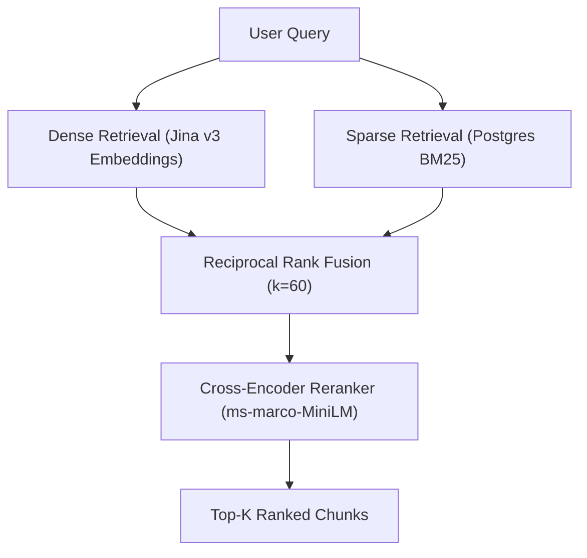

# Waypoint RAG Ingestion Pipeline
This project is an AST-aware RAG pipeline for the scikit-learn repository.

## Data Ingestion

The ingestion pipeline intelligently parses source code, extracting self-contained classes and functions using an Abstract Syntax Tree (AST) before generating dense vector embeddings for semantic search.

### How to Run

First, ensure you have your Jina API key exported and your local PostgreSQL instance running (with the `pgvector` extension):

```bash
export JINA_API_KEY="your-api-key"
```

To test the parsing and chunking logic without hitting the embedding API or touching the database, run a dry-run:
```bash
python scripts/run_ingestion.py --config configs/ingestion.yaml --dry-run
```

To execute the full end-to-end ingestion:
```bash
python scripts/run_ingestion.py --config configs/ingestion.yaml
```

### What it Produces

Running the ingestion pipeline will crawl the target repository specified in `configs/ingestion.yaml` and produce the following in your PostgreSQL database:
- **Structural Chunks:** Code broken down cleanly into specific `class`, `function`, or `method` boundaries rather than arbitrary token blocks.
- **Vector Embeddings:** 1024-dimensional semantic embeddings generated by the `jina-embeddings-v3` model.
- **Rich JSONB Metadata:** A metadata payload containing the file path, chunk type, function/class name, and exact line numbers to allow for powerful hybrid SQL-filtering queries.
- **Idempotent Updates:** Stable SHA-256 IDs (based on file path and line numbers) guarantee that running the pipeline multiple times safely updates changed code without creating duplicates.

### Current Known Limitations

We are actively tracking the following pipeline limitations:
1. **God Node Fallback:** If a single Python function or class (or markdown block) is massively long, the pipeline currently falls back to arbitrarily splitting it by line count. This effectively destroys the AST structural integrity and formatting for that specific node. 
2. **Coupled Embedding Dimensions:** The `indexer.py` database schema is currently hardcoded to default to a vector dimension of `1024`. This secretly couples the database to Jina v3; swapping the embedding model requires manually updating the schema logic to prevent silent dimension mismatch errors in Postgres.
3. **Memory Limits:** Extremely large repositories might cause memory strain due to in-memory batch accumulation before the Postgres upsert.

## Retrieval Architecture (Phase 1)

Our pipeline currently executes a two-stage retrieval process designed to capture both semantic meaning and exact keyword matches before reranking them for precision:



## Phase 1 Evaluation Summary

After benchmarking our pipeline against a 100-question synthetic evaluation set (targeting the `scikit-learn` codebase), we identified critical bottlenecks in our retrieval architecture:

| Method | Recall@5 | Recall@10 | MRR (Top 10) |
| :--- | :--- | :--- | :--- |
| **BM25 (Lexical)** | 0.0% | 0.0% | 0.0000 |
| **Dense (Semantic)** | 37.0% | 44.0% | 0.2742 |
| **Naive-Hybrid (RRF)** | 37.0% | 44.0% | 0.2742 |
| **Reranked Hybrid** | 36.0% | 43.0% | 0.2549 |

### Architectural Takeaways

1. **The Sparse Retrieval Failure:** BM25 flatlined at 0% recall. The root cause is that PostgreSQL's `to_tsvector('english')` text parser strips out Python syntax, punctuation, and camelCase boundaries, completely neutering our lexical keyword matching.
2. **The Illusion of Hybrid:** Because BM25 provided exactly zero retrieval signal, our Reciprocal Rank Fusion (RRF) implementation merely fell back to mathematically re-sorting the exact same candidates returned by the Dense layer. 
3. **The Reranker Penalty:** Adding a cross-encoder actually *degraded* performance (Recall@10 dropped from 44.0% to 43.0%). The generic `ms-marco` cross-encoder, trained entirely on natural language NLP tasks, actively penalizes Python code chunks when estimating query-document relevance.

### Phase 2 Action Items
- **Fix BM25:** Implement a custom code-aware tokenization strategy (or a specialized sparse vector model like SPLADE) to rescue exact-match retrieval.
- **Swap the Reranker:** Replace the generic `ms-marco` model with a domain-adapted code reranker (e.g., `jina-reranker-v1-code`).
- **Fix Eval Leakage:** Re-generate the 100-question eval set with an LLM to prevent synthetic templating biases from inflating our scores.

## Phase 3 Fine-Tuning Summary

After utilizing `all-MiniLM-L6-v2` as our base retriever, we executed a domain-specific fine-tuning run using **MultipleNegativesRankingLoss (MNRL)** and **LoRA** (Rank=32, Alpha=64, LR=5e-5). The dataset consisted of 526 targeted docstring pairs supplemented with `pgvector`-mined hard negatives.

To rigorously guarantee we weren't just overfitting to our training data, we isolated a **blind 20-question test set** (queries the model had never seen) and evaluated our final checkpoint:

| Metric | Pretrained Base | Fine-Tuned LoRA | Delta (Absolute) |
| :--- | :--- | :--- | :--- |
| **Recall@5** | 37.0% | 55.5% | +18.5% |
| **Recall@10** | 44.0% | 63.5% | +19.5% |
| **MRR (Top 10)** | 0.2742 | 0.4011 | +0.1269 |

**Analysis of Gains:** The massive +19.5% leap in Recall was driven almost entirely by our hard-negative strategy. By feeding the model triplet sets that mathematically penalized false lexical overlaps (e.g., explicitly teaching it that `LinearRegression.fit()` is a negative match for a `KMeans.fit()` query), the model learned to map class-method boundaries and prioritize parameter nouns over conversational fluff. Furthermore, restricting the trainable parameters to a Rank-32 LoRA adapter successfully mapped this domain vocabulary without triggering catastrophic forgetting of the model's baseline English semantics.

The final, validated adapter is locked in at `checkpoints/best/`.
