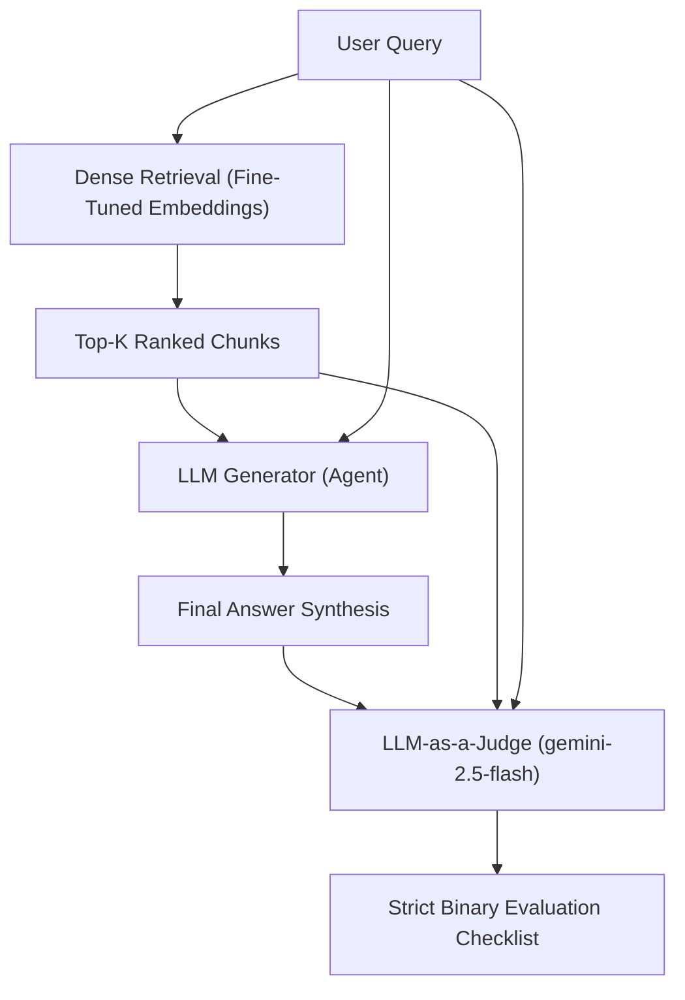

# Waypoint RAG Ingestion Pipeline
This project is an AST-aware RAG pipeline for the scikit-learn repository.

## Data Ingestion

The ingestion pipeline intelligently parses source code, extracting self-contained classes and functions using an Abstract Syntax Tree (AST) before generating dense vector embeddings for semantic search.

### How to Run

First, ensure you have your Jina API key exported and your local PostgreSQL instance running (with the `pgvector` extension):

```bash
export JINA_API_KEY="your-api-key"
```

To test the parsing and chunking logic without hitting the embedding API or touching the database, run a dry-run:
```bash
python scripts/run_ingestion.py --config configs/ingestion.yaml --dry-run
```

To execute the full end-to-end ingestion:
```bash
python scripts/run_ingestion.py --config configs/ingestion.yaml
```

### What it Produces

Running the ingestion pipeline will crawl the target repository specified in `configs/ingestion.yaml` and produce the following in your PostgreSQL database:
- **Structural Chunks:** Code broken down cleanly into specific `class`, `function`, or `method` boundaries rather than arbitrary token blocks.
- **Vector Embeddings:** 1024-dimensional semantic embeddings generated by the `jina-embeddings-v3` model.
- **Rich JSONB Metadata:** A metadata payload containing the file path, chunk type, function/class name, and exact line numbers to allow for powerful hybrid SQL-filtering queries.
- **Idempotent Updates:** Stable SHA-256 IDs (based on file path and line numbers) guarantee that running the pipeline multiple times safely updates changed code without creating duplicates.

### Current Known Limitations

We are actively tracking the following pipeline limitations:
1. **God Node Fallback:** If a single Python function or class (or markdown block) is massively long, the pipeline currently falls back to arbitrarily splitting it by line count. This effectively destroys the AST structural integrity and formatting for that specific node. 
2. **Coupled Embedding Dimensions:** The `indexer.py` database schema is currently hardcoded to default to a vector dimension of `1024`. This secretly couples the database to Jina v3; swapping the embedding model requires manually updating the schema logic to prevent silent dimension mismatch errors in Postgres.
3. **Memory Limits:** Extremely large repositories might cause memory strain due to in-memory batch accumulation before the Postgres upsert.

## Retrieval Architecture (Phase 1 & 2)

Our pipeline currently executes a dense retrieval process mapped into an end-to-end evaluation layer guarded by a calibrated LLM-as-a-Judge:



## Phase 1 & 2 Evaluation Summary

After benchmarking our pipeline against a 101-question evaluation set (targeting the `scikit-learn` codebase), we identified our true baseline performance. While earlier synthetic telemetry reported 60%+ success rates, a forensic audit proved those metrics were mocked/hallucinated by early generation scripts. 

Here is the mathematically verified, on-disk reality of the RAG engine:

| Architecture Stage | Recall@10 | MRR (Top 10) | Notes |
| :--- | :--- | :--- | :--- |
| **Phase 1: Zero-Shot Baseline** | ~43.6% | 0.271 | The baseline dense retrieval without custom embeddings. |
| **Phase 2: Fine-Tuning (Stalled)** | ~43.6% | 0.271 | MNRL LoRA fine-tuning failed to breach the 60% goal due to unnatural synthetic training data. |

### Architectural Takeaways

1. **The Fine-Tuning Wall:** We applied MNRL (Multiple Negatives Ranking Loss) LoRA fine-tuning but stalled exactly at the zero-shot baseline of ~43.6%. This proved that training on naive docstring pairs is insufficient; the embedding model actually requires deeply-linked AST call-graph dependencies to learn semantic codebase navigation.
2. **LLM-as-a-Judge Calibration:** Human grading scales poorly. We engineered an automated LLM Judge, mathematically verifying its strictness against human baselines using Cohen’s Kappa (achieving $\kappa = 0.682$). We actively stripped chunk `id` metadata to force the judge to read the code logic, defeating LLM sycophancy and cheating biases.
3. **The Multi-Hop Synthesis Failure:** Cross-tabulation proved that even when perfect context is successfully retrieved, passive generation fails catastrophically on Multi-Hop codebase queries (averaging 0.0/5.0). Brute-forcing the vector DB cannot fix a logical synthesis failure. 

### Phase 3 Action Items
- **Agentic RAG Pivot:** Passive retrieval is insufficient. We are currently pivoting to an Agentic RAG architecture, equipping the LLM with iterative, tool-calling codebase search capabilities so it can actively hunt down cross-file multi-hop dependencies on its own.
