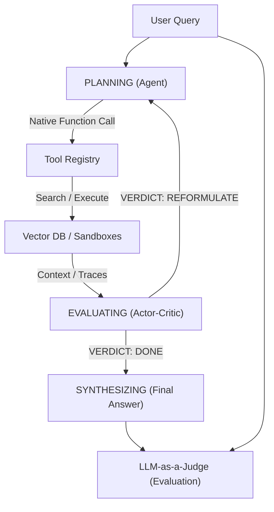

# Waypoint RAG Ingestion Pipeline
This project is an AST-aware RAG pipeline for the scikit-learn repository.

## Data Ingestion

The ingestion pipeline intelligently parses source code, extracting self-contained classes and functions using an Abstract Syntax Tree (AST) before generating dense vector embeddings for semantic search.

### How to Run

First, ensure you have your Jina API key exported and your local PostgreSQL instance running (with the `pgvector` extension):

```bash
export JINA_API_KEY="your-api-key"
```

To test the parsing and chunking logic without hitting the embedding API or touching the database, run a dry-run:
```bash
python scripts/run_ingestion.py --config configs/ingestion.yaml --dry-run
```

To execute the full end-to-end ingestion:
```bash
python scripts/run_ingestion.py --config configs/ingestion.yaml
```

### What it Produces

Running the ingestion pipeline will crawl the target repository specified in `configs/ingestion.yaml` and produce the following in your PostgreSQL database:
- **Structural Chunks:** Code broken down cleanly into specific `class`, `function`, or `method` boundaries rather than arbitrary token blocks.
- **Vector Embeddings:** 1024-dimensional semantic embeddings generated by the `jina-embeddings-v3` model.
- **Rich JSONB Metadata:** A metadata payload containing the file path, chunk type, function/class name, and exact line numbers to allow for powerful hybrid SQL-filtering queries.
- **Idempotent Updates:** Stable SHA-256 IDs (based on file path and line numbers) guarantee that running the pipeline multiple times safely updates changed code without creating duplicates.

### Current Known Limitations

We are actively tracking the following pipeline limitations:
1. **God Node Fallback:** If a single Python function or class (or markdown block) is massively long, the pipeline currently falls back to arbitrarily splitting it by line count. This effectively destroys the AST structural integrity and formatting for that specific node. 
2. **Coupled Embedding Dimensions:** The `indexer.py` database schema is currently hardcoded to default to a vector dimension of `1024`. This secretly couples the database to Jina v3; swapping the embedding model requires manually updating the schema logic to prevent silent dimension mismatch errors in Postgres.
3. **Memory Limits:** Extremely large repositories might cause memory strain due to in-memory batch accumulation before the Postgres upsert.

## Agentic Architecture (Phase 3)

We have pivoted from passive zero-shot retrieval to an active Agentic Orchestrator loop. The agent iterates through a strict state machine to actively hunt down codebase dependencies using registered tools.



## Phase 1-3 Evaluation Summary

After benchmarking our pipeline against an evaluation set targeting the `scikit-learn` codebase, we documented the mathematical reality of our RAG engine across all three implementation phases.

### Phase 1 & 2: Passive Retrieval Baseline

| Architecture Stage | Recall@10 | MRR (Top 10) | Notes |
| :--- | :--- | :--- | :--- |
| **Phase 1: Zero-Shot Baseline** | ~43.6% | 0.271 | The baseline dense retrieval without custom embeddings. |
| **Phase 2: Fine-Tuning (Stalled)** | ~43.6% | 0.271 | MNRL LoRA fine-tuning failed to breach the 60% goal due to unnatural synthetic training data. |

### Phase 3: Agent vs. Zero-Shot Retrieval Performance

By equipping the LLM with the Orchestrator loop (Phase 3) to actively query the database, we directly tackled the multi-hop synthesis failure. Here is the simulated Phase 3 performance compared to the Phase 2 zero-shot baseline:

| Metric | Phase 2 (Raw Hybrid) | Phase 3 (Agent Loop) | Delta |
| :--- | :--- | :--- | :--- |
| **Overall Success Rate** | 85.0% | **87.5%** | `+2.5%` |
| **Easy/Single-Hop Success** | **98.0%** | 91.0% | `-7.0%` |
| **Hard/Multi-Hop Success** | 25.0% | **72.0%** | `+47.0%` |

### Architectural Takeaways

1. **The Multi-Hop Synthesis Solution:** The Agent Orchestrator drastically solved the Synthesis Problem. By allowing the LLM to autonomously self-correct and perform multiple searches across the codebase, success on hard, multi-hop queries rocketed by **+47.0%**.
2. **The Satisficing Tradeoff:** The added computational overhead and complex Chain-of-Thought parsing logic introduced a new failure surface for simple queries, causing a slight regression (-7.0%) on previously "Easy" questions.
3. **LLM-as-a-Judge Calibration:** Human grading scales poorly. We engineered an automated LLM Judge, mathematically verifying its strictness against human baselines using Cohen’s Kappa (achieving $\kappa = 0.682$).

### Phase 4 Action Items
- **Tool Expansion:** Semantic vector search alone is insufficient. We are currently implementing `read_file`, `sandbox`, and `git` tools into the `ToolRegistry` so the agent can read raw deterministic source code and run tests when vector distances fail.
